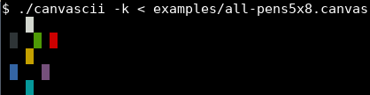
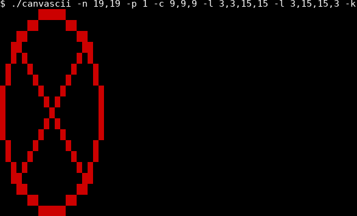

Ce document décrit le travail pratique 1 du cours [INF3135 Construction et
maintenance de logiciels](https://etudier.uqam.ca/cours?sigle=INF3135) au
trimestre d'été 2020. Le cours est enseigné par Alexandre Blondin Massé,
professeur au [département d'informatique](http://info.uqam.ca/),
à l'[Université du Québec à Montréal](https://uqam.ca/).

Le travail doit être remis au plus tard le **19 juin à 23h59**. À partir de
minuit, une pénalité de **2 points** par heure de retard sera appliquée.

## Objectifs pédagogiques

Les principaux objectifs pédagogiques visés sont les suivants:

- Vous initier au langage de **programmation C**.
- Vous initier à l'utilisation du logiciel de contrôle de versions **Git** lors
  d'un développement en **solitaire**.
- Vous familiariser à la compilation d'un programme à l'aide d'un **Makefile**
  simple.
- Vous habituer à décomposer un programme en **petites fonctions**.
- Vous familiariser avec le passage d'arguments par **adresse**.
- Vous familiariser avec l'utilisation de l'**entrée standard** (`stdin`) et de
  la **sortie standard** (`stdout`)
- Vous familiariser avec le traitement des **arguments** d'un programme et des
  **codes de retour**

## Description du travail

Vous devez concevoir un programme C nommé `canvascii.c` qui permet de dessiner
sur un canevas ASCII. Le canevas peut être initialisé ou lu sur l'entrée
standard (`stdin`). Le résultat est ensuite affiché sur la sortie standard
(`stdout`). Votre programme devra avoir un comportement très précis afin
d'automatiser la correction, mais également afin d'automatiser les tests. Vous
devrez donc vous assurer de ne pas écrire de messages superflus sur `stdout` ou
`stderr` et de bien écrire **tels quels** les messages d'erreurs.

Un canevas est représenté par un fichier texte contenant `h` lignes de même
longueur `w`. Les seuls caractères acceptés sont les suivants:

- `.` désigne un pixel non occupé
- `0`, `1`, ..., `7` désignent respectivement un pixel de couleur *noire*,
  *rouge*, *vert*, *jaune*, *bleu*, *magenta*, *cyan*, *blanc* (voir les [codes
  de couleur ANSI](https://en.wikipedia.org/wiki/ANSI_escape_code#3/4_bit))

Un exemple de canevas valide avec `h = 5`, `w = 8` et utilisant les 7 couleurs
est:

```
...7....
.0..2.1.
...3....
.4...5..
...6....
```

Lorsque vous lancez le programme sans argument, un manuel d'utilisation doit
être affiché sur la sortie standard:

```text
$ ./canvascii
Usage: ./canvascii [-n HEIGHT,WIDTH] [-s] [-k] [-p CHAR]
          [-h ROW] [-v COL] [-r ROW,COL,HEIGHT,WIDTH]
          [-l ROW1,COL1,ROW2,COL2] [-c ROW,COL,RADIUS]
Draws on an ASCII canvas. The canvas is provided on stdin and
the result is printed on stdout. The dimensions of the canvas
are limited to at most 40 rows and at most 80 columns.

If no argument is provided, the program prints this help and exit.

Canvas options:
  -n HEIGHT,WIDTH           Creates a new empty canvas of HEIGHT rows and
                            WIDTH columns. Should be used as first option,
                            otherwise, the behavior is undefined.
                            Ignores stdin.
  -s                        Shows the canvas and exit.
  -k                        Enables colored output. Replaces characters
                            between 0 and 9 by their corresponding ANSI
                            colors:
                              0: black  1: red      2: green  3: yellow
                              4: blue   5: magenta  6: cyan   7: white

Drawing options:
  -p CHAR                   Sets the pen to CHAR. Allowed pens are
                            0, 1, 2, 3, 4, 5, 6 or 7. Default pen
                            is 7.
  -h ROW                    Draws an horizontal line on row ROW.
  -v COL                    Draws a vertical line on column COL.
  -r ROW,COL,HEIGHT,WIDTH   Draws a rectangle of dimension HEIGHTxWIDTH
                            with top left corner at (ROW,COL).
  -l ROW1,COL1,ROW2,COL2    Draws a discrete segment from (ROW1,COL1) to
                            (ROW2,COL2) with Bresenham's algorithm.
  -c ROW,COL,RADIUS         Draws a circle centered at (ROW,COL) of
                            radius RADIUS with the midpoint algorithm.
```

## Options supportées

À la fin, votre programme devra offrir les options suivantes.

### Option `-n`: création d'un canevas

Cette option permet de créer un canevas dans lequel tous les pixels sont vides
(le pixel vide est identifié par le caractère `.`):

```sh
$ ./canvascii -n 2,4
....
....
```

En particulier, lorsque l'option `-n` est utilisée en premier, la lecture sur
`stdin` est ignorée:

```sh
$ ./canvascii -n 2,4 < examples/empty5x8.canvas
....
....
```

Noter que les dimensions maximales autorisées sont `40,80`.

### Option `-s`: affichage du canevas

Lorsque l'option `-s` est utilisée, le canevas est affiché sur la sortie
standard et le programme termine son exécution:

```sh
$ ./canvascii -s < examples/empty5x8.canvas
........
........
........
........
........
```

En particulier, s'il y a des options qui suivent `-s`, elles sont simplement
ignorées:

```sh
$ ./canvascii -s -h 0 < examples/empty5x8.canvas
........
........
........
........
........
```

### Option `-h`: tracé d'une ligne horizontale

L'option `-h` permet de tracer une ligne horizontale occupant la largeur de
tout le canevas:

```sh
$ ./canvascii -n 3,7 -h 1
.......
7777777
.......
```

Si le numéro de ligne est hors canevas, un message d'erreur est affiché et le
manuel d'utilisation est rappelé:

```sh
$ ./canvascii -n 3,5 -h 6
Error: incorrect value with option -h
Usage: ./canvascii [-n HEIGHT,WIDTH] [-s] [-k] [-p CHAR]
          [-h ROW] [-v COL] [-r ROW,COL,HEIGHT,WIDTH]
          [-l ROW1,COL1,ROW2,COL2] [-c ROW,COL,RADIUS]
[...]
$ echo $?
7
```

### Option `-v`: tracé d'une ligne verticale

L'option `-v` permet de tracer une ligne verticale occupant la haute de tout le
canevas:

```sh
$ ./canvascii -n 3,7 -v 1 -v 3 -v 5
.7.7.7.
.7.7.7.
.7.7.7.
```

Comme pour l'option `-h`, si le numéro de colonne est hors canevas, un message
d'erreur est affiché et le manuel d'utilisation est rappelé:

```sh
$ ./canvascii -n 3,5 -v 5
Error: incorrect value with option -v
Usage: ./canvascii [-n HEIGHT,WIDTH] [-s] [-k] [-p CHAR]
          [-h ROW] [-v COL] [-r ROW,COL,HEIGHT,WIDTH]
          [-l ROW1,COL1,ROW2,COL2] [-c ROW,COL,RADIUS]
[...]
$ echo $?
7
```

### Option `-r`: tracé d'un rectangle

L'option `-r` permet de tracer un rectangle sur le canevas:

```sh
$ ./canvascii -n 5,7 -r 1,1,3,5
.......
.77777.
.7...7.
.77777.
.......
```

Si certains points du rectangle se trouvent hors canevas, il n'y a pas
d'erreur, les pixels sont tout simplement rognés:

```sh
$ ./canvascii -n 5,7 -r 1,1,8,8
.......
.777777
.7.....
.7.....
.7.....
```

Les positions peuvent être négatives:

```sh
$ ./canvascii -n 5,5 -r -1,-1,3,3
.7...
77...
.....
.....
.....
```

Mais pas les dimensions:

```sh
$ ./canvascii -n 5,5 -r 1,1,-2,-2
Error: incorrect value with option -r
Usage: ./canvascii [-n HEIGHT,WIDTH] [-s] [-k] [-p CHAR]
          [-h ROW] [-v COL] [-r ROW,COL,HEIGHT,WIDTH]
          [-l ROW1,COL1,ROW2,COL2] [-c ROW,COL,RADIUS]
[...]
```

### Option `-l`: tracé d'un segment

Il est possible de tracer un segment discret avec l'option `-l`:

```sh
$ ./canvascii -n 6,13 -l 1,1,4,11
.............
.77..........
...777.......
......7777...
..........77.
.............
```

Si le segment sort du canevas, il est rogné:

```sh
$ ./canvascii -n 4,10 -l 1,1,4,11
..........
.77.......
...777....
......7777
```

Les positions avec des valeurs négatives sont acceptées:

```sh
$ ./canvascii -n 5,5 -l -2,6,6,-2
....7
...7.
..7..
.7...
7....
```

L'algorithme utilisé pour tracer un segment discret est appelé [Algorithme de
Bresenham](https://en.wikipedia.org/wiki/Bresenham%27s_line_algorithm). Le
pseudocode traitant tous les octants simultanément se trouve à la fin de la
section [*All
cases*](https://en.wikipedia.org/wiki/Bresenham%27s_line_algorithm?section=7#All_cases)
de l'article Wikipedia en anglais qui traite de ce sujet.

### Option `-c`: tracé d'un cercle

On peut également tracer un cercle discret à l'aide de l'option `-c`:

```sh
$ ./canvascii -n 11,11 -c 5,5,5
...77777...
..7.....7..
.7.......7.
7.........7
7.........7
7.........7
7.........7
7.........7
.7.......7.
..7.....7..
...77777...
```

Comme pour les options `-r` et `-l`, si le cercle sort du canevas, il est tout
simplement rogné:

```sh
$ ./canvascii -n 5,5 -c 4,4,3
.....
...77
..7..
.7...
.7...
```

Le centre du cercle peut avoir des coordonnées négatives:

```sh
$ ./canvascii -n 5,5 -c -1,-1,5
....7
....7
...7.
..7..
77...
```

Mais pas son rayon:

```sh
$ ./canvascii -n 5,5 -c 1,1,-2
Error: incorrect value with option -c
Usage: ./canvascii [-n HEIGHT,WIDTH] [-s] [-k] [-p CHAR]
          [-h ROW] [-v COL] [-r ROW,COL,HEIGHT,WIDTH]
          [-l ROW1,COL1,ROW2,COL2] [-c ROW,COL,RADIUS]
[...]
```

L'algorithme utilisé pour tracer un cercle discret est appelé [Algorithme de
tracé d'arc de cercle par point
milieu](https://en.wikipedia.org/wiki/Midpoint_circle_algorithm). Une
implémentation de cet algorithme en C est disponible sur le site [Rosetta
Code](http://rosettacode.org/wiki/Bitmap/Midpoint_circle_algorithm#C).
N'hésitez pas à la récupérer, à l'adapter à votre programme et ensuite à citer
sa provenance.

### Option `-p`: sélection du crayon

En tout temps, on peut changer le crayon utilisé pour dessiner:

```sh
$ ./canvascii -n 5,5 -p 4 -h 2 -p 2 -v 2
..2..
..2..
44244
..2..
..2..
```

Par défaut, le crayon utilisé est `7`.

### Option `-k`: colorisation du canevas

Finalement, il est possible d'afficher une sortie en couleur en transformant
les caractères `0` à `7` par leur [code de couleur
ANSI](https://en.wikipedia.org/wiki/ANSI_escape_code#3/4_bit) correspondant:

```sh
$ ./canvascii -k < examples/all-pens5x8.canvas
```



```sh
$ ./canvascii -n 19,19 -p 1 -c 9,9,9 -l 3,3,15,15 -l 3,15,15,3 -k
```



## Gestion des erreurs

Votre programme doit détecter les erreurs d'utilisation. Pour cela, vous devez
utiliser les codes d'erreur suivants (identifiés à l'aide d'un type énumératif
en C):

```c
enum error {
    OK                         = 0, // Everything is ok
    ERR_WRONG_PIXEL            = 1, // Wrong pixel value in canvas
    ERR_CANVAS_TOO_HIGH        = 2, // Canvas is too high
    ERR_CANVAS_TOO_WIDE        = 3, // Canvas is too wide
    ERR_CANVAS_NON_RECTANGULAR = 4, // Canvas is non rectangular
    ERR_UNRECOGNIZED_OPTION    = 5, // Unrecognized option
    ERR_MISSING_VALUE          = 6, // Option with missing value
    ERR_WITH_VALUE             = 7  // Problem with value
}
```

Lorsqu'une erreur survient, un message en conséquence, suivi du manuel
d'utilisation est affiché sur le canal d'erreur (`stderr`):

1. Si un caractère apparaissant dans le canevas est interdit:

```sh
$ ./canvascii -s < examples/wrong-char.canvas
Error: wrong pixel value #
Usage: ./canvascii [-n HEIGHT,WIDTH] [-s] [-k] [-p CHAR]
          [-h ROW] [-v COL] [-r ROW,COL,HEIGHT,WIDTH]
          [-l ROW1,COL1,ROW2,COL2] [-c ROW,COL,RADIUS]
[...]
$ echo $?
1
```

2. Si le canevas lu sur `stdin` est trop haut:

```sh
$ ./canvascii -s < examples/too-high.canvas
Error: canvas is too high (max height: 40)
Usage: ./canvascii [-n HEIGHT,WIDTH] [-s] [-k] [-p CHAR]
          [-h ROW] [-v COL] [-r ROW,COL,HEIGHT,WIDTH]
          [-l ROW1,COL1,ROW2,COL2] [-c ROW,COL,RADIUS]
[...]
$ echo $?
2
```

3. Si le canevas lu sur `stdin` est trop large:

```sh
$ ./canvascii -s < examples/too-wide.canvas
Error: canvas is too wide (max width: 80)
Usage: ./canvascii [-n HEIGHT,WIDTH] [-s] [-k] [-p CHAR]
          [-h ROW] [-v COL] [-r ROW,COL,HEIGHT,WIDTH]
          [-l ROW1,COL1,ROW2,COL2] [-c ROW,COL,RADIUS]
[...]
$ echo $?
3
```

4. Si les lignes du canevas lu sur `stdin` ne sont pas toutes de même longueur:

```sh
$ ./canvascii -s < examples/non-uniform-width.canvas
Error: canvas should be rectangular
Usage: ./canvascii [-n HEIGHT,WIDTH] [-s] [-k] [-p CHAR]
          [-h ROW] [-v COL] [-r ROW,COL,HEIGHT,WIDTH]
          [-l ROW1,COL1,ROW2,COL2] [-c ROW,COL,RADIUS]
[...]
$ echo $?
4
```

5. Si on tente d'utiliser une option non reconnue:

```sh
$ ./canvascii -n 5,5 -a
Error: unrecognized option -a
Usage: ./canvascii [-n HEIGHT,WIDTH] [-s] [-k] [-p CHAR]
          [-h ROW] [-v COL] [-r ROW,COL,HEIGHT,WIDTH]
          [-l ROW1,COL1,ROW2,COL2] [-c ROW,COL,RADIUS]
[...]
$ echo $?
5
```

6. Si on oublie de fournir une valeur à une option qui en demande une:

```sh
$ ./canvascii -n
Error: missing value with option -n
Usage: ./canvascii [-n HEIGHT,WIDTH] [-s] [-k] [-p CHAR]
          [-h ROW] [-v COL] [-r ROW,COL,HEIGHT,WIDTH]
          [-l ROW1,COL1,ROW2,COL2] [-c ROW,COL,RADIUS]
[...]
$ echo $?
6
```

7. Finalement, si on fournit une valeur mal formatée ou invalide:

```sh
$ ./canvascii -n 5,5 -p a
Error: incorrect value with option -p
Usage: ./canvascii [-n HEIGHT,WIDTH] [-s] [-k] [-p CHAR]
          [-h ROW] [-v COL] [-r ROW,COL,HEIGHT,WIDTH]
          [-l ROW1,COL1,ROW2,COL2] [-c ROW,COL,RADIUS]
[...]
$ echo $?
7
```

Voir le fichier [`check.bats`](check.bats) pour plus d'exemples de test. En cas
de doute sur le comportement à adopter dans certaines situations, n'hésitez pas
à poser des questions à l'enseignant.

## Tâches à accomplir

Afin de compléter ce travail pratique, vous devrez suivre les étapes suivantes:

1. Créez un clone (*fork*) du [dépôt du
   projet](https://gitlab.info.uqam.ca/inf3135-ete2020/inf3135-ete2020-tp1).
2. Assurez-vous que le dépôt soit privé, pour éviter le plagiat.
3. Donnez accès à votre dépôt à l'utilisateur `blondin_al` en mode `Developer`.
4. Familiarisez-vous avec le contenu du dépôt, en étudiant chacun des fichiers
   (`README.md`, `sujet.md`, `check.bats`, `.gitlab-ci.yml`, etc.).
5. Commencez votre développement en versionnant fréquemment l'évolution de
   votre projet avec Git. La qualité de votre versionnement sera évaluée, il
   est donc important de valider (*commit*) chaque fois que vous avez terminé
   une petite tâche.
6. Ajoutez un fichier `Makefile` pour qu'il exécute toutes les tâches
   demandées.
7. Complétez le fichier `README.md` en respectant le format Markdown et en
   tenant compte des instructions qui y sont présentes.
8. Complétez le fichier `canvascii.c`.

### Clone et création du dépôt

Vous devez cloner le dépôt fourni et l'héberger sur la plateforme [Gitlab du
département](https://gitlab.info.uqam.ca/). Votre dépôt devra se nommer
**exactement** `inf3135-ete2020-tp1` et l'URL devra être **exactement**
`https://gitlab.info.uqam.ca/<utilisateur>/inf3135-ete2020-tp1`, où
`<utilisateur>` doit être remplacé par votre code MS de l'UQAM ou par votre nom
d'utilisateur. Il devra être **privé** et accessible seulement par vous et par
l'utilisateur `blondin_al`.

### Fichier `canvascii.c`

L'organisation du contenu de votre fichier `canvascii.c` est laissée à votre
discrétion, mais je vous suggère tout de même d'utiliser minimalement les
déclarations suivantes (n'oubliez pas de les documenter):

```c
#define MAX_HEIGHT 40
#define MAX_WIDTH 80
#define USAGE "\
Usage: %s [-n HEIGHT,WIDTH] [-s] [-k] [-p CHAR]\n\
          [-h ROW] [-v COL] [-r ROW,COL,HEIGHT,WIDTH]\n\
          [-l ROW1,COL1,ROW2,COL2] [-c ROW,COL,RADIUS]\n\
Draws on an ASCII canvas. The canvas is provided on stdin and\n\
the result is printed on stdout. The dimensions of the canvas\n\
are limited to at most 40 rows and at most 80 columns.\n\
\n\
If no argument is provided, the program prints this help and exit.\n\
\n\
Canvas options:\n\
  -n HEIGHT,WIDTH           Creates a new empty canvas of HEIGHT rows and\n\
                            WIDTH columns. Should be used as first option,\n\
                            otherwise, the behavior is undefined.\n\
                            Ignores stdin.\n\
  -s                        Shows the canvas and exit.\n\
  -k                        Enables colored output. Replaces characters\n\
                            between 0 and 9 by their corresponding ANSI\n\
                            colors:\n\
                              0: black  1: red      2: green  3: yellow\n\
                              4: blue   5: magenta  6: cyan   7: white\n\
\n\
Drawing options:\n\
  -p CHAR                   Sets the pen to CHAR. Allowed pens are\n\
                            0, 1, 2, 3, 4, 5, 6 or 7. Default pen\n\
                            is 7.\n\
  -h ROW                    Draws an horizontal line on row ROW.\n\
  -v COL                    Draws a vertical line on column COL.\n\
  -r ROW,COL,HEIGHT,WIDTH   Draws a rectangle of dimension HEIGHTxWIDTH\n\
                            with top left corner at (ROW,COL).\n\
  -l ROW1,COL1,ROW2,COL2    Draws a discrete segment from (ROW1,COL1) to\n\
                            (ROW2,COL2) with Bresenham's algorithm.\n\
  -c ROW,COL,RADIUS         Draws a circle centered at (ROW,COL) of\n\
                            radius RADIUS with the midpoint algorithm.\n\
"

struct canvas {
    char pixels[MAX_HEIGHT][MAX_WIDTH]; // A matrix of pixels
    unsigned int width;                 // Its width
    unsigned int height;                // Its height
    char pen;                           // The character we are drawing with
};

enum error {
    OK                         = 0, // Everything is ok
    ERR_WRONG_PIXEL            = 1, // Wrong pixel value in canvas
    ERR_CANVAS_TOO_HIGH        = 2, // Canvas is too high
    ERR_CANVAS_TOO_WIDE        = 3, // Canvas is too wide
    ERR_CANVAS_NON_RECTANGULAR = 4, // Canvas is non rectangular
    ERR_UNRECOGNIZED_OPTION    = 5, // Unrecognized option
    ERR_MISSING_VALUE          = 6, // Option with missing value
    ERR_WITH_VALUE             = 7  // Problem with value
};
```

### Makefile

Vous devrez supporter les cibles suivantes dans votre Makefile:

- La commande `make` crée l'exécutable `canvascii` s'il y a eu une modification
  du fichier `canvascii.c` en le compilant selon le standard C11, avec les
  options `-Wall` et `-Wextra` lors de la compilation.
- La commande `make html` transforme les fichiers `README.md` et `sujet.md` en
  HTML à l'aide du logiciel [Pandoc](https://pandoc.org/) en utilisant le style
  CSS fourni dans le fichier [`misc/github-pandoc.css`](misc/github-pandoc.css)
- La commande `make test` recompile l'exécutable si nécessaire, puis lance la
  suite de tests contenue dans le fichier `check.bats` **non modifié**, livré
  dans le dépôt que vous avez cloné.
- La commande `make clean` supprime les fichiers inutiles ou générés (`.o`,
  `.html`, etc.).

N'oubliez pas les **dépendances** pour chaque cible s'il y en a.

### Fichier `README.md`

Vous devez compléter le fichier `README.md` livré dans le dépôt en suivant les
instructions qui y sont indiquées. Assurez-vous également de répondre aux
questions suivantes:

- À quoi sert votre programme?
- Comment le compiler?
- Comment l'exécuter?
- Quels sont les formats d'entrées et de sorties?
- Quels sont les cas d'erreur gérés?

Vous devez utiliser la syntaxe Markdown pour écrire une documentation claire et
lisible. Vous pouvez en tout temps vérifier localement le fichier HTML produit
sur votre machine à l'aide de [Pandoc](https://pandoc.org/), mais il est aussi
conseillé de vérifier, avant la remise finale, que le résultat produit sur la
page d'accueil de GitLab est celui auquel vous vous attendez.

Évitez d'abuser du gras, de l'italique et du HTML brut dans le fichier
`README.md`. Exploitez au maximum les listes à puces et formatez les noms de
fichier et le code à l'aide des apostrophes inversés. Finalement, soignez la
qualité de votre français, qui sera prise en considération dans le fichier
`README.md`.

### Git

Il est important de suivre l'évolution de votre projet à l'aide de Git. Vous
devez cloner (à l'aide du bouton *fork*) le gabarit du projet fourni et ajouter
vos modifications à l'aide de *commits*. En particulier, il est possible que je
doive apporter des corrections ultérieures à l'énoncé que vous pourrez
récupérer facilement si nous avons un historique **commun**.

N'oubliez pas de bien configurer correctement votre fichier `.gitconfig` qui
permet de vous identifier comme auteur de *commits*, en y indiquant vos
**véritables** prénom, nom et courriel.

Les messages de *commit* doivent suivre une des conventions suivantes:

- [How to write a Git commit
  message](https://chris.beams.io/posts/git-commit/), par Chris Beams
- [Conventional commits](https://www.conventionalcommits.org/en/v1.0.0/), par
  différentes personnes

Finalement, n'oubliez pas d'inclure un fichier `.gitignore` en fonction de
votre environnement de développement. Aussi, assurez-vous de ne pas versionner
de fichiers inutiles (les fichiers binaires, entre autres, mais pas seulement).

### Correction

L'exécution de votre programme sera vérifiée automatiquement grâce à une suite
de tests rédigée en [Bats](https://github.com/bats-core/bats-core). Bien
entendu, vous devez installer Bats pour le faire fonctionner. Pour faciliter
votre développement, vous avez accès à un certain nombre de tests *publics*
pour corriger vos travaux (dans le fichier `check.bats`). Il suffit d'entrer la
commande

```sh
$ bats check.bats
```

pour lancer la suite de tests.

Cependant, prenez note que la couverture de tests n'est pas **complète**. Je me
réserve donc la possibilité d'ajouter des tests supplémentaires pour la
correction finale. Si vous avez un doute sur le comportement attendu d'une
certaine situation, je vous invite à me poser des questions pour que je puisse
apporter des précisions à l'ensemble de la classe si nécessaire.

### Barème

Les critères d'évaluation sont les suivants:

| Critère             |  Points |
|:--------------------|--------:|
| Fonctionnabilité    |     /50 |
| Qualité du code     |     /15 |
| Documentation       |     /15 |
| Makefile            |      /5 |
| Utilisation de Git  |     /15 |
| Total               |    /100 |

Plus précisément, les éléments suivants seront pris en compte:

- **Fonctionnalité (50 points)**: Le programme passe les tests *publics* et
  *privés* en affichant le résultat attendu.

- **Qualité du code (15 points)**: Les identifiants utilisés sont significatifs
  et ont une syntaxe uniforme, le code est bien indenté, il y a de l'aération
  autour des opérateurs et des parenthèses, le programme est simple et lisible.
  Pas de bout de code en commentaire ou de commentaires inutiles. Pas de valeur
  magique. Le code doit être bien factorisé (pas de redondance). Il est
  décomposé en petites fonctions qui effectuent des tâches spécifiques. La
  présentation est soignée. *Note*: si votre style est impeccable mais que
  votre travail est peu avancé, vous aurez peu de points pour cette partie.

- **Documentation (15 points)**: Le fichier `README.md` est complet et respecte
  le format Markdown. L'en-tête du fichier `canvascii.c` est bien documentée,
  de même que chacune des fonctions (*docstrings*) en suivant le standard
  Javadoc.

- **Makefile (5 points)**: Le Makefile supporte les appels `make`, `make html`,
  `make test` et `make clean`. Toutes les dépendances de ces cibles sont
  présentes.

- **Utilisation de Git (15 points)**: Les modifications sont réparties en
  *commits* atomiques. Le fichier `.gitignore` est complet. Les messages de
  *commit* sont significatifs, uniformes et suivent une des conventions
  suggérées.

### Pénalités

Tout programme qui ne compile pas se verra automatiquement attribuer
**la note 0**.

En outre, si vous ne respectez pas les critères suivants, une pénalité
de **50%** sera imposée :

- Votre dépôt doit se nommer **exactement** `inf3135-ete2020-tp1`
- L'URL de votre dépôt doit être **exactement**
  `https://gitlab.info.uqam.ca/<utilisateur>/inf3135-ete2020-tp1` où
  `<utilisateur>` doit être remplacé par votre identifiant
- L'utilisateur `blondin_al` doit avoir accès à votre projet en mode
  *Developer*.
- Votre dépôt doit être un *fork* du [gabarit
  fourni](https://gitlab.info.uqam.ca/inf3135-ete2020/inf3135-ete2020-tp1).
- Votre dépôt doit être **privé**.
- Il est interdit d'utiliser les fonctions `getopt` et `getopt_long` des
  bibliothèques `unistd.h` et `getopt.h`.
- Il est interdit d'utiliser l'**allocation dynamique** dans ce travail
  (fonctions `malloc`, `calloc`, `realloc`, `free`).

## Remise

La remise se fait automatiquement en ajoutant l'utilisateur `blondin_al` en
mode *Developer*, vous n'avez rien de plus à faire. À moins d'indication
contraire de votre part, ce sera le dernier (*commit*) disponible sur votre
branche `master` qui sera considéré pour la correction.

Le travail doit être remis au plus tard le **19 juin à 23h59**. À partir de
minuit, une pénalité de **2 points** par heure de retard sera appliquée.
